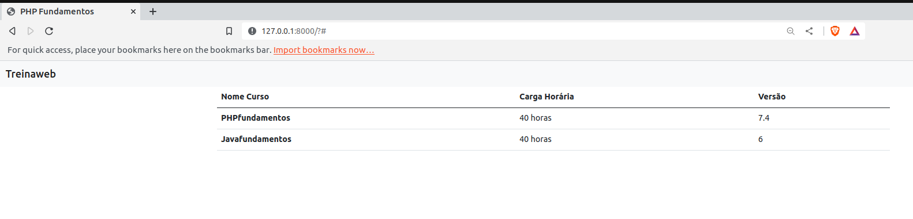

# Final Project - PHP Fundamentals

 - <a href="https://www.treinaweb.com.br/certificado/TABNPIQC9PDL" target="_blank">Certificate</a> -
<a href="https://www.treinaweb.com.br/curso/php-fundamentos/ementa/php-fundamentos.pdf" target="_blank">Syllabus</a>

## Goal

> The project was based in a model developed with the instructor of the course. The objective was apply the concepts of PHP language  applied to a HTML page and a table template using BOOTSTRAP

### FrontEnd

> The code was commented in portuguese, and it's very simple to undertand 